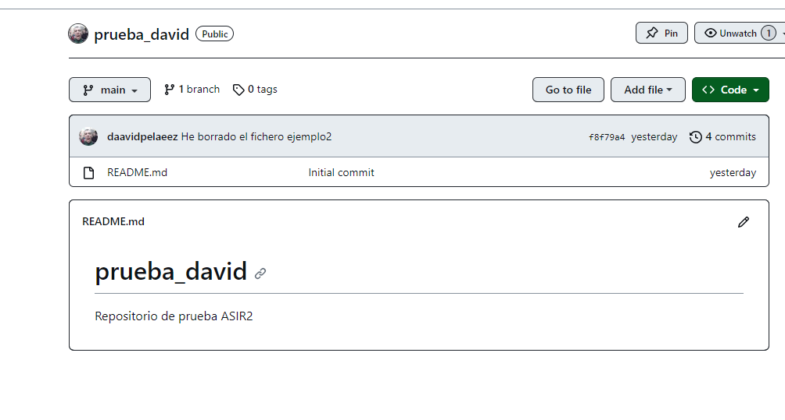
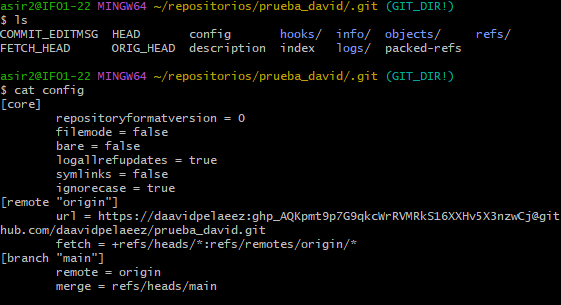
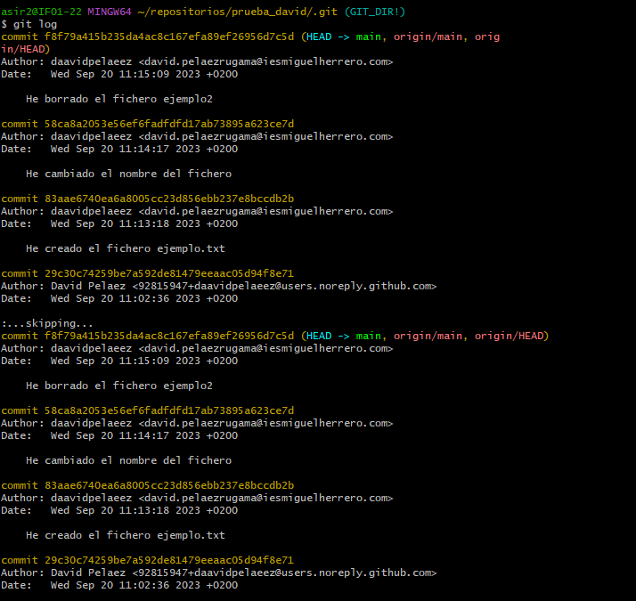
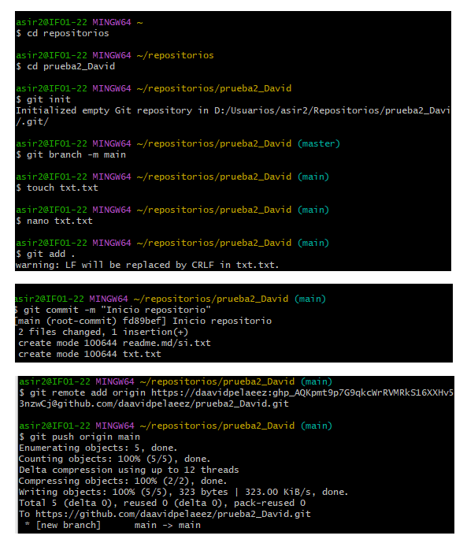
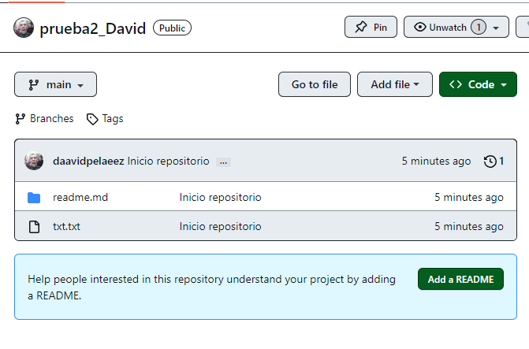

# REPOSITORIO PRUEBA_DAVID MARKDOWN
### 1. Una captura de pantalla donde se vea que has creado correctamente el repositorio.
# 
### 2.El contenido del fichero .git/config para que se vea que has clonado el repositorio con la URL ssh (o la URL https si te has conectado por token).
# 
### 3.La salida de la instrucción git log para ver los commits que has realizado (debe aparecer como autor tu nombre completo).

### 4.Buscar información para crear un nuevo repositorio llamado prueba2_tu_nombre. En esta ocasión, crea primero el repositorio local (usando git init) y luego busca información para sincronizarlo y crear el repositorio remoto en GitHub. Comenta los pasos que has realizado y manda alguna prueba de funcionamiento.

