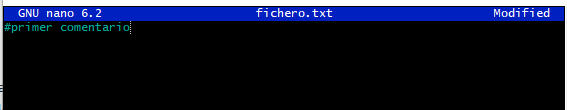

## Crea una rama que se llame primera en tu local, y ejecuta la instrucción necesaria para comprobar que se ha creado.

## Crea un nuevo fichero en esta rama y fusiónalo con la principal. ¿Se ha producido conflicto? Razona la respuesta.
## Borra la rama primera.

## Crea una rama que se llame segunda, y modifica un fichero en ella para producir un conflicto al unirlo a la rama principal. Entrega el contenido del fichero donde se ha producido el conflicto.

## Soluciona el conflicto que has creado en el punto anterior y sincroniza la rama segunda en el remoto. Entrega una captura de pantalla donde se vea que se ha creado la rama en el repositorio de GitHub.
