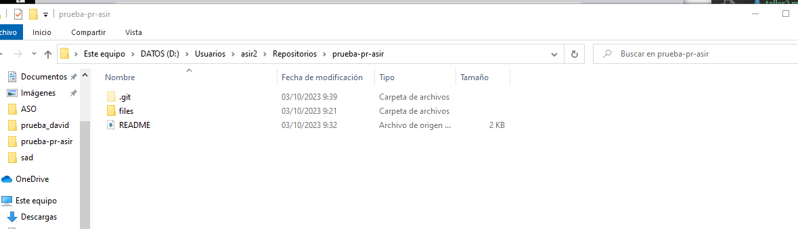
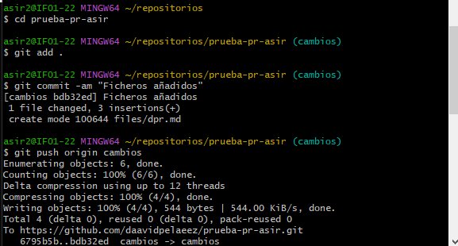
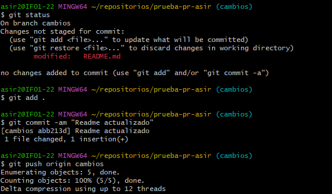
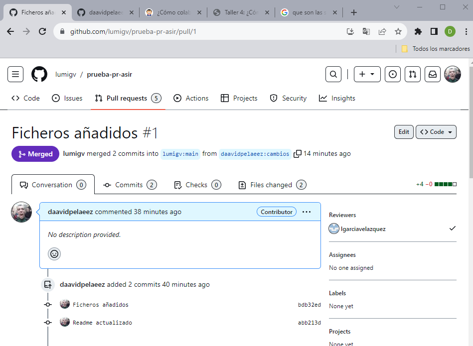

## Hacemos los cambios en local despues de haber hecho el fork del repositorio

## Realizamos el git add .

## Realizamos el git push tambien del readme ya que no se me subieron los dos archivos a la vez

## Una vez hecho el git push al dueño del archivo le sale una peticion para realizar los cambios, mirara que todo este correcto y si es así aprobara los cambios.
